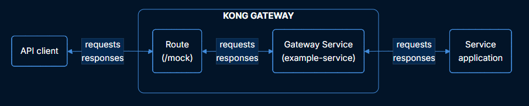
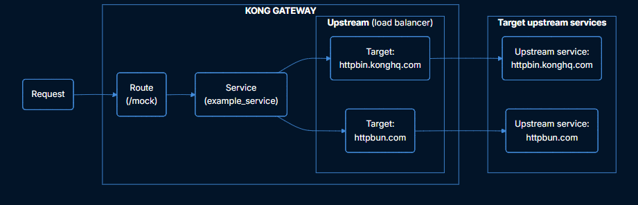
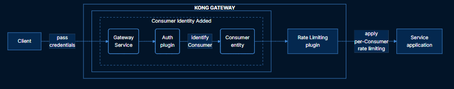

# Kong Gateway Introduction

Kong Gateway is a lightweight, fast, and flexible cloud-native API gateway/reverse proxy that manage, configure, and route requests to service APIs.

## 1. Architecture

Kong is leveraging NGINX via another technology called OpenResty, one of the top three most used web servers in the world

- OpenResty is a technology that embeds the super-fast LuaJIT (a just-in-time compiler) into the highly performant NGINX to allow extension with modules created in a higher-level language (Lua)

## 2. Entities

Reference: [Kong Gateway entities](https://developer.konghq.com/gateway/entities/)

Entities are the components and objects that make up the Kong API Gateway and its ecosystem

- **Gateway Services**: Represent the upstream services or APIs. They serve as the logical targets to which traffic will be proxied after routing is completed.
- **Routes**: Routes are used to match incoming requests and direct them to the appropriate Gateway Service. They also define which plugins are applied for transforming the proxied request or response.
- **Plugins**: A Plugin entity represents the configuration for a specific plugin instance.
- **Workspaces**: Workspaces are a way of namespacing Kong Gateway entities so they can be managed independently
- **Partials**: Partials allow reusing shared **Redis** configurations across plugins

- **Upstream**: An Upstream entity abstracts a group of backend targets behind a single logical name. It enables load balancing, health checks, circuit-breaking, retry logic, etc.
- **Targets**: A Target identifies an instance of an upstream service using an IP address or hostname with a port. Each Upstream can have many Targets.

- **Consumers**: A Consumer entity represents an authenticated client or user of an API. It does not interact with requests by itself; instead, plugins use the consumer's identity for credential validation, authentication, rate-limiting quotas or access control decisions
- **Consumer Groups**: Consumer Groups allow applying common configurations to groups of Consumers, such as rate limiting policies or request and response transformation.

> [!NOTE]
> Consumers are always identified before any upstream call is made. 

### Security Enitities

- **SNIs**
- **Certificates**
- **CA Certificates**
- **Vaults**
- **Keys**
- **Key Sets**

### Konnect Platform

Kong Konnect is a unified API platform that manages APIs, LLMs, events, and microservices, consolidating API and connectivity management. It is delivered as a SaaS control plane for Kong Gateway and associated services.

- Konnect provides several built-in applications that run on top of the Konnect platform to help manage, monitor, and secure your API ecosystem, as well as provide a customizable developer experience.